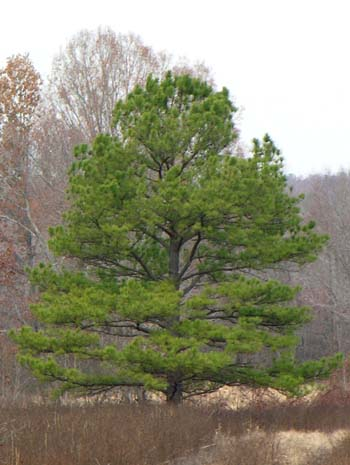

## Overview
<hr noshade size=4 color='blue'>  
<BR>
<b>This presentation will cover:</b>

1. What are Loblolly Pine Trees? <hr>
2. Purpose of this Analysis<hr>
3. Methods used in Analysis<hr>

--- .class #id 

## What are Loblolly Pine Trees?
<hr noshade size=4 color='blue'> 
<BR>
<style type="text/css">
#wrap {
   width:800px;
   margin:0 0 0 0;
}
#left_col {
   float:left;
   width:450px;
   padding-right: 50px;
}
#right_col {
   float:right;
   width:300px;
}
</style>

<div id="wrap">
    <div id="left_col">     
<p>According to the U.S. Forest Service, pinus taeda, commonly known as loblolly pine, is one of several pines native to the Southeastern United States, from central Texas east to Florida, and north to Delaware and southern New Jersey. </p>
<p>
Its needles are in bundles of three, sometimes twisted, and measure 12–22 cm 
(4.7–8.7 in) long.
</p>
    </div>
    
<div id="right_col">  

</IMG>
    </div>
</div>

---- .class #id 

## Purpose of this Analysis
<hr noshade size=4 color='blue'>  
<BR>
<p>Many naturalists, when strolling through a forest, question how old the trees are.</p> 

<p>One technique to determine the age of a tree would be to cut down the tree and count the rings in the trunk. This method would ruin the tree.</p>

<p><b>What other method could we use without ruining the tree?</b></p>


--- .class #id 

## Another method to use
<hr noshade size=4 color='blue'>  

<b><font size=5>Predict the age of the tree by using its height in a logistic regression model.</font></b>

<div id="wrap">
    <div id="left_col">  
<font size=4>Initial data was taken from Loblolly data in the datasets package in R.
By using the existing heights of the trees in this dataset, the following logistic prediction results/formula was calculated to predict the age of another Loblolly tree.</h4><hr>
<h4><b>Predicted Age =  .7574 + .3783*height of tree</b> </font> 
<hr noshade size=4 color='red'>  
<font size=4><b>Here are the steps to run the application:</b></font>
<ul>
<li><font size=4>Take a walk through the forest and pick a Loblolly tree, what is it's height?</font></li>
<li><font size=4>Enter the height of this tree in the application and hit <b>Submit</b></font></li>
<li><font size=4>The predicted age will be calculated.</font></li>
</ul>
 </div>
    
<div id="right_col">  

```{r simple-plot, fig.height = 6, fig.align = 'left', message = F, echo=FALSE}
plot(height~age, data=Loblolly, pch=19, col='purple', main="Loblolly Pine Tree Data - Height by Age", xlab="Tree Age (in years)", ylab="Tree Height (in feet)")
``` 

</div>
</div>